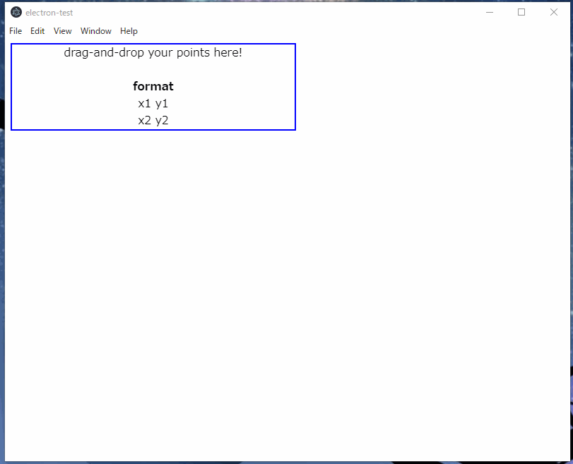

# DDPoints

- Dragしたファイルを点データと見なしてSVG.js経由で描画する


# 開発環境

- Windows 10
- Node.js v10.15.3
- Electron@5.0.0 (npm install --save-dev electron)
- svg.js@2.7.1


# 実行

```bash
npm start
```

# 動作イメージ



# 悩んだ実装

- JavaScriptでファイルを読み込む
  - 参考: http://superbrothers.hatenablog.com/entry/2012/12/11/003310
- SVG.jsの対象となるdiv領域を初期化する
  - 参考: https://stackoverflow.com/questions/3674265/is-there-an-easy-way-to-clear-an-svg-elements-contents
